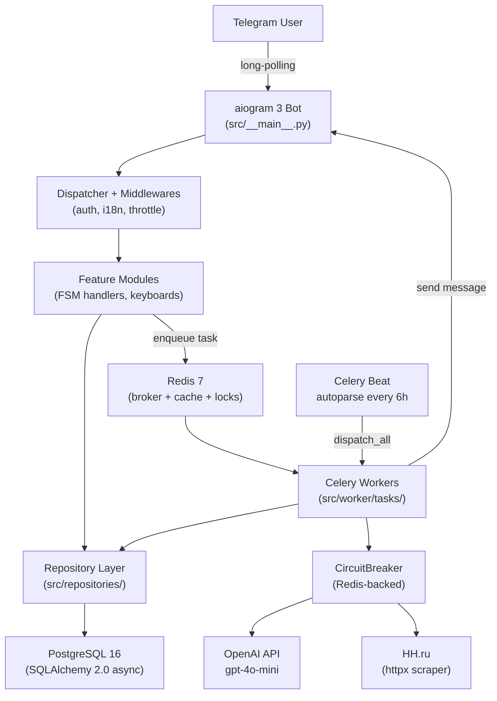

# HH Bot — HeadHunter Job Search Assistant

A feature-rich Telegram bot that helps Russian-speaking job seekers work with HeadHunter (hh.ru). It combines async web scraping, a full-featured aiogram 3 FSM bot, and an OpenAI layer to automate and enrich every stage of the job-search workflow — from vacancy analysis to resume building and interview preparation.

---

## Features

| Feature | Description |
|---|---|
| **Manual Parsing** | User provides an HH search URL; the bot scrapes N vacancies, extracts tech keywords, and aggregates the most common ones |
| **AI Keyword Extraction** | OpenAI extracts and normalises technology mentions from raw vacancy descriptions |
| **Key Phrase Generation** | Streaming AI generation of resume bullet points anchored to the aggregated keywords |
| **Autoparse Feed** | Scheduled automatic scraping of saved searches; new vacancies delivered as a Tinder-style swipe feed |
| **Compatibility Scoring** | OpenAI scores each vacancy against the user's own tech stack (0–100); configurable threshold filters the feed |
| **Work Experience CRUD** | Full add/edit/delete lifecycle for work experience entries with AI-generated achievements and duties |
| **Achievement Generation** | Batch AI generation of 4–6 achievement bullets per work experience entry |
| **Interview Tracking** | Record interview Q&A pairs; AI analyses weak areas and generates step-by-step improvement plans |
| **Interview Preparation** | AI generates a 5–8 step guide per upcoming interview; each step supports deep-dive expansion and a multiple-choice quiz |
| **Standard Interview QA** | AI pre-generates personalized answers to common HR questions (best achievement, 5-year plan, etc.) |
| **Vacancy Summary** | Generates a professional "About Me" section for resumes, anchored to work experience |
| **Resume Wizard** | Multi-step wizard: key phrases → about-me → final assembled resume |
| **Admin Panel** | User management (ban/unban, balance), app settings, circuit breaker controls |
| **Support Tickets** | In-bot support system with bidirectional admin ↔ user messaging |
| **Referral System** | Referral links via `/start ref_<code>` deep links with balance rewards |
| **Blacklist** | Per-user, per-context vacancy deduplication with configurable expiry |
| **i18n** | Fluent translation files for Russian and English; locale middleware in place |

### HH.ru apply via Playwright (optional)

When the official applicant API is unavailable, set `HH_UI_APPLY_ENABLED=true` and use a **saved browser session** (Playwright `storage_state`) instead of OAuth REST calls for “Respond” in the feed. The bot acknowledges the Telegram callback before slow Playwright steps so the client does not hit the ~10s callback timeout while loading resumes.

**Ways to provide `storage_state`:**

1. **Telegram JSON upload** — Settings → HeadHunter accounts → Add account (when OAuth is off): send the `.json` file produced locally (see below).
2. **Server-side login assist (optional)** — Set `HH_LOGIN_ASSIST_ENABLED=true` and use “Server login” in the same menu. Run the **`celery_worker_login_assist`** service from [`docker-compose.yml`](docker-compose.yml) (Dockerfile target `login_assist`: Xvfb, noVNC/websockify on port 6080). Set **`HH_LOGIN_ASSIST_VIEWER_URL`** to your HTTPS (or LAN test) noVNC URL, e.g. `https://your-host/vnc.html` or `http://server:6080/vnc.html`. Default Celery workers only consume queue `celery`; login assist uses queue `login_assist`. See [docs/HH_LOGIN_ASSIST.md](docs/HH_LOGIN_ASSIST.md).

**Local script (for file upload path):**

1. Run `alembic upgrade head` so `hh_linked_accounts` has `browser_storage_enc` (and `browser_storage_updated_at`).
2. Install Chromium for Playwright: `playwright install chromium` (after `pip install -e .`).
3. Run `python scripts/hh_browser_login.py` from the project root, complete login in the opened window, press Enter. This writes `hh_browser_storage_state.json`.
4. Send that file to the bot (or encrypt into DB manually as before).

**Risks (server login):** CAPTCHA, datacenter IP blocks, and hh.ru terms are uncertain; prefer honest user messaging on failure. Daily limits: `HH_LOGIN_ASSIST_MAX_PER_DAY` (server login) and `HH_UI_APPLY_MAX_PER_DAY` (apply). Delays for apply: `HH_UI_MIN_ACTION_DELAY_MS`, `HH_UI_MAX_ACTION_DELAY_MS` in `.env`.

**Apply mechanism:** With `HH_UI_APPLY_USE_POPUP_API=true` (default), the worker posts to the same `/applicant/vacancy_response/popup` endpoint the site uses (in-page `fetch` with session cookies). It does **not** automate clicking the “Respond” button or the modal. If the session is expired, the outcome is session-related and **login screenshots are not sent** to the user as error images.

The anti‑CSRF token for that POST is taken from the same sources the browser uses: hidden `input` / `meta` on the page when present, otherwise often the **`_xsrf` cookie** on `.hh.ru` (visible to Playwright even when HttpOnly). The runner waits until a token is available from DOM, cookie, or embedded HTML before sending the request.

**Small VPS (about 2 GB RAM / 1 vCPU):** keep the dedicated `hh_ui` worker at **`worker_concurrency=1`**, lower `HH_UI_APPLY_BATCH_SIZE` if the host swaps or Celery logs `missed heartbeat`, and widen `HH_UI_NAVIGATION_TIMEOUT_MS` only if pages are legitimately slow (not as a fix for CPU starvation). Celery Beat runs `hh_ui.periodic_resume_checkpoints` every five minutes so Redis checkpoints for apply batches can be re-enqueued after a worker stall or restart.

---

## Architecture



---

## Tech Stack

| Component | Technology | Version |
|---|---|---|
| Language | Python | ≥ 3.12 |
| Bot framework | aiogram | ≥ 3.26 |
| Database | PostgreSQL | 16 |
| ORM | SQLAlchemy (asyncio) | ≥ 2.0 |
| DB driver | asyncpg | ≥ 0.30 |
| Migrations | Alembic | ≥ 1.14 |
| Task queue | Celery | ≥ 5.4 |
| Broker / cache | Redis | ≥ 7 (client ≥ 5.2) |
| HTTP client | httpx | ≥ 0.28 |
| AI | OpenAI (AsyncOpenAI) | ≥ 1.61 |
| Config | pydantic-settings | ≥ 2.7 |
| Logging | structlog + Rich | ≥ 24.4 / ≥ 13.9 |
| HTML parsing | BeautifulSoup4 | ≥ 4.12 |
| i18n | fluent.runtime | ≥ 0.4 |
| Testing | pytest + pytest-asyncio + pytest-mock + respx | ≥ 8.3 |
| Linting | Ruff | ≥ 0.9 |
| Containerisation | Docker + Docker Compose | — |

---

## Project Structure

```
hh_bot/
├── docker-compose.yml              # PostgreSQL, Redis, bot, Celery (queues celery + login_assist)
├── Dockerfile                      # Multi-stage: app (default), login_assist (Xvfb/noVNC for HH login assist)
├── docker/
│   └── entrypoint-login-assist.sh  # Xvfb + x11vnc + websockify before Celery (target login_assist)
├── pyproject.toml                  # Dependencies, pytest, ruff config
├── alembic.ini
├── alembic/
│   ├── env.py
│   └── versions/                   # 18 migration files
├── scripts/
│   └── seed_roles.py               # Seed admin/user roles and permissions
├── src/
│   ├── __main__.py                 # Async entry point (bot + webhook/polling)
│   ├── config.py                   # pydantic-settings — all environment variables
│   ├── core/
│   │   ├── logging.py              # structlog + Rich + Telegram error channel
│   │   └── i18n.py                 # aiogram-i18n Fluent setup
│   ├── db/
│   │   ├── base.py                 # DeclarativeBase with id + created_at
│   │   └── engine.py               # Async engine + async_session_factory
│   ├── models/                     # SQLAlchemy 2.0 ORM models (one file per domain)
│   ├── repositories/               # Data-access layer (one *Repository per model)
│   ├── services/
│   │   ├── ai/
│   │   │   ├── client.py           # AIClient — AsyncOpenAI wrapper
│   │   │   ├── prompts.py          # Pure prompt-builder functions (15+ prompts)
│   │   │   ├── streaming.py        # stream_to_telegram() — throttled token streaming
│   │   │   └── interview_parser.py # Parse structured AI interview responses
│   │   ├── parser/
│   │   │   ├── scraper.py          # HHScraper — httpx + BeautifulSoup pagination
│   │   │   ├── extractor.py        # ParsingExtractor — full manual-parse pipeline
│   │   │   ├── keyword_match.py    # OR / AND keyword filter (| and , operators)
│   │   │   ├── report.py           # Multi-format report (txt / md / Telegram message)
│   │   │   └── hh_parser_service.py # Simplified scraper used by autoparse tasks
│   │   ├── progress_service.py     # Redis-backed pinned progress bars
│   │   └── task_checkpoint.py      # Resume-on-crash checkpoint for long tasks
│   ├── bot/
│   │   ├── create.py               # Bot + Dispatcher factory; router registration
│   │   ├── middlewares/            # AuthMiddleware, I18nMiddleware, ThrottleMiddleware
│   │   ├── filters/                # AdminFilter, RoleFilter
│   │   ├── callbacks/              # Shared CallbackData base classes
│   │   ├── keyboards/              # Shared inline keyboard builders
│   │   └── modules/
│   │       ├── start/              # /start, deep links, main menu routing
│   │       ├── parsing/            # Manual parsing FSM + results + export
│   │       ├── autoparse/          # Autoparse config + vacancy feed (swipe UI)
│   │       ├── work_experience/    # Work experience CRUD + AI generation
│   │       ├── achievements/       # Batch achievement generation
│   │       ├── interviews/         # Interview tracking, Q&A, AI analysis
│   │       ├── interview_prep/     # Prep guide, deep dive, quizzes
│   │       ├── interview_qa/       # Standard HR question answers
│   │       ├── vacancy_summary/    # "About Me" generation
│   │       ├── resume/             # Resume wizard (3-step)
│   │       ├── profile/            # User profile and stats
│   │       ├── user_settings/      # Language, timezone
│   │       ├── admin/              # Admin panel
│   │       └── support/            # Support tickets
│   ├── worker/
│   │   ├── app.py                  # Celery app + Beat schedule
│   │   ├── circuit_breaker.py      # Redis-backed circuit breaker (closed/open/half-open)
│   │   ├── signals.py              # worker_init signal → inject DB session factory
│   │   ├── utils.py                # run_async() — run coroutines from sync tasks
│   │   └── tasks/
│   │       ├── parsing.py          # Manual parse pipeline task
│   │       ├── ai.py               # Key phrase generation task
│   │       ├── autoparse.py        # Dispatch, run, deliver autoparse tasks
│   │       ├── interviews.py       # Interview analysis + improvement flow
│   │       ├── interview_prep.py   # Prep guide, deep dive, quiz generation
│   │       ├── interview_qa.py     # Standard QA generation
│   │       ├── vacancy_summary.py  # About-me generation
│   │       ├── achievements.py     # Batch achievement generation
│   │       └── work_experience.py  # AI achievements/duties + resume key phrases
│   └── locales/                    # Fluent translation files (ru, en)
└── tests/
    ├── conftest.py                 # Shared fixtures (make_vacancy, mock_session, …)
    ├── unit/                       # ~45 unit test files (fully offline)
    └── integration/                # ~5 integration test files (handler + repo + mock DB)
```

---

## Prerequisites

- **Python 3.12+**
- **Docker** and **Docker Compose** (for PostgreSQL and Redis, or full deployment)
- A **Telegram bot token** from [@BotFather](https://t.me/BotFather)
- An **OpenAI API key** (or compatible endpoint)

---

## Local Development

### 1. Clone and configure

```bash
git clone <repo-url> hh_bot
cd hh_bot
cp .env.example .env
```

Edit `.env` with your values:

```dotenv
BOT_TOKEN=123456:ABC-your-bot-token
OPENAI_API_KEY=sk-your-key
ADMIN_TELEGRAM_IDS=your_telegram_user_id
```

### 2. Start infrastructure

```bash
docker compose up -d postgres redis
docker compose ps   # verify both are "Up (healthy)"
```

### 3. Set up Python environment

```bash
python -m venv .venv

# Linux / macOS
source .venv/bin/activate

# Windows (PowerShell)
.venv\Scripts\Activate.ps1

pip install -e ".[dev]"
```

### 4. Run database migrations

```bash
alembic upgrade head
```

### 5. Seed roles and permissions

```bash
python scripts/seed_roles.py
```

### 6. Start the bot

```bash
python -m src
```

### 7. Start the Celery worker (separate terminal)

```bash
# Linux / macOS
celery -A src.worker.app worker --loglevel=info --concurrency=4

# Windows — use solo pool (prefork causes PermissionError with billiard semaphores)
celery -A src.worker.app worker --loglevel=info --pool=solo
```

### 8. Run tests

```bash
pytest
pytest --cov=src   # with coverage report
```

### 9. Lint and format

```bash
ruff check src/ tests/
ruff format src/ tests/
```

---

## Docker Compose (Full Stack)

```bash
cp .env.example .env
# Set POSTGRES_HOST=postgres and REDIS_HOST=redis (Docker service names)

docker compose up -d --build
docker compose exec bot alembic upgrade head
docker compose exec bot python scripts/seed_roles.py
```

View logs:

```bash
docker compose logs -f bot
docker compose logs -f celery_worker
```

### Useful Docker commands

Connect to PostgreSQL inside the container:

```bash
docker compose exec postgres psql -U ${POSTGRES_USER:-hh_bot} -d ${POSTGRES_DB:-hh_bot}
```

Connect to Redis inside the container:

```bash
docker compose exec redis redis-cli
```

Open a shell in the main Celery worker container:

```bash
docker compose exec celery_worker sh
```

Inspect Celery queues and active tasks:

```bash
docker compose exec celery_worker celery -A src.worker.app inspect active
docker compose exec celery_worker celery -A src.worker.app inspect reserved
docker compose exec celery_worker celery -A src.worker.app inspect scheduled
```

Remove all queued Celery tasks:

```bash
docker compose exec celery_worker celery -A src.worker.app purge -f
```

Stop current Celery workers and start them again:

```bash
docker compose restart celery_worker celery_worker_hh_ui celery_worker_login_assist
```

If you want to clear queued tasks and restart all workers in one go:

```bash
docker compose exec celery_worker celery -A src.worker.app purge -f
docker compose restart celery_worker celery_worker_hh_ui celery_worker_login_assist
```

Notes:

- `purge` removes queued tasks from the broker; it does not kill a task that is already running inside a worker process.
- `restart` stops the current worker containers, which also interrupts in-flight tasks.
- If you want to inspect worker health first, run `docker compose ps` and `docker compose logs -f celery_worker`.

---

## Deploying to Ubuntu Server

### 1. Server preparation

```bash
sudo apt update && sudo apt upgrade -y
sudo apt install -y git curl ufw

curl -fsSL https://get.docker.com | sudo sh
sudo usermod -aG docker $USER
sudo apt install -y docker-compose-plugin
# Log out and back in for group changes to take effect
```

### 2. Firewall

The bot uses long-polling (outbound only); no inbound ports are needed for Telegram:

```bash
sudo ufw default deny incoming
sudo ufw default allow outgoing
sudo ufw allow ssh
sudo ufw enable
```

### 3. Clone and configure

```bash
cd /opt
sudo mkdir hh_bot && sudo chown $USER:$USER hh_bot
git clone <repo-url> hh_bot
cd hh_bot
cp .env.example .env
nano .env
```

Production `.env` values:

```dotenv
BOT_TOKEN=your-production-bot-token

POSTGRES_USER=hh_bot
POSTGRES_PASSWORD=<strong-random-password>
POSTGRES_DB=hh_bot
POSTGRES_HOST=postgres
POSTGRES_PORT=5432

REDIS_HOST=redis
REDIS_PORT=6379
REDIS_DB=0

OPENAI_API_KEY=sk-your-key
OPENAI_BASE_URL=https://api.openai.com/v1
OPENAI_MODEL=gpt-4o-mini

LOG_LEVEL=INFO
LOG_TELEGRAM_CHAT_ID=<chat-id-for-error-alerts>
SUPPORT_CHAT_ID=<chat-id-for-support>

ADMIN_TELEGRAM_IDS=your_telegram_id
```

### 4. Build and start

```bash
docker compose up -d --build
docker compose exec bot alembic upgrade head
docker compose exec bot python scripts/seed_roles.py
```

### 5. Verify

```bash
docker compose ps                      # all services should be "Up (healthy)"
docker compose logs -f bot             # look for "Bot is polling..."
docker compose logs -f celery_worker   # look for "ready" message
```

Send `/start` to your bot in Telegram to confirm it's responding.

For low-RAM servers (2GB) and resource tuning, see [docs/DEPLOYMENT.md](docs/DEPLOYMENT.md).

### 6. Auto-restart on reboot

Services are configured with `restart: unless-stopped`. Enable Docker autostart:

```bash
sudo systemctl enable docker
```

### 7. Updates

```bash
cd /opt/hh_bot
git pull
docker compose up -d --build
docker compose exec bot alembic upgrade head   # only if migrations changed
```

### 8. Backups

```bash
# Manual backup
docker compose exec postgres pg_dump -U hh_bot hh_bot > backup_$(date +%Y%m%d_%H%M%S).sql

# Restore
cat backup.sql | docker compose exec -T postgres psql -U hh_bot hh_bot
```

Automated daily backup (cron):

```bash
mkdir -p /opt/hh_bot/backups
crontab -e
```

```cron
0 3 * * * cd /opt/hh_bot && docker compose exec -T postgres pg_dump -U hh_bot hh_bot | gzip > /opt/hh_bot/backups/backup_$(date +\%Y\%m\%d).sql.gz
```

---

## Environment Variables Reference

| Variable | Required | Default | Description |
|---|---|---|---|
| `BOT_TOKEN` | Yes | — | Telegram bot token from BotFather |
| `POSTGRES_USER` | No | `hh_bot` | PostgreSQL username |
| `POSTGRES_PASSWORD` | No | `hh_bot_secret` | PostgreSQL password |
| `POSTGRES_DB` | No | `hh_bot` | PostgreSQL database name |
| `POSTGRES_HOST` | No | `localhost` | PostgreSQL host (`postgres` in Docker) |
| `POSTGRES_PORT` | No | `5432` | PostgreSQL port |
| `REDIS_HOST` | No | `localhost` | Redis host (`redis` in Docker) |
| `REDIS_PORT` | No | `6379` | Redis port |
| `REDIS_DB` | No | `0` | Redis database number |
| `OPENAI_API_KEY` | No | — | OpenAI API key |
| `OPENAI_BASE_URL` | No | `https://api.openai.com/v1` | OpenAI-compatible API endpoint |
| `OPENAI_MODEL` | No | `gpt-4o-mini` | Model to use for all AI tasks |
| `LOG_LEVEL` | No | `INFO` | Logging level |
| `LOG_TELEGRAM_CHAT_ID` | No | — | Chat ID for ERROR+ log alerts |
| `SUPPORT_CHAT_ID` | No | — | Chat ID for support ticket notifications |
| `ADMIN_TELEGRAM_IDS` | No | — | Comma-separated Telegram user IDs for initial admins |
| `HH_USER_AGENT` | No | `HHBot/1.0 (dev@localhost)` | Identifies your app to `api.hh.ru` (see [HH API](https://github.com/hhru/api)); use a stable `Name/Version (contact)` string |
| `HH_VACANCY_DETAIL_CONCURRENCY` | No | `5` | Max parallel `GET /vacancies/{id}` per parse job; lower if workers get HTTP 403 |

Runtime-adjustable flags (managed through the admin panel, stored in the `app_settings` DB table):

| Key | Description |
|---|---|
| `task_parsing_enabled` | Enable / disable the manual parsing task |
| `task_autoparse_enabled` | Enable / disable autoparse background jobs |
| `autoparse_interval_hours` | Hours between autoparse Beat dispatches |
| `blacklist_days` | How many days a vacancy stays blacklisted |
| `cb_parsing_failure_threshold` | Circuit breaker — failures before opening |
| `cb_parsing_recovery_timeout` | Circuit breaker — seconds before half-open |

---

## Testing

### Layout

```
tests/
├── conftest.py              # Shared fixtures: make_vacancy, mock_session, make_feed_session
├── unit/
│   ├── conftest.py          # mock_openai_response, HTML fixtures for scraper
│   ├── test_circuit_breaker.py
│   ├── test_scraper.py / test_scraper_enhanced.py
│   ├── test_keyword_match.py
│   ├── test_extractor.py
│   ├── test_report.py
│   ├── test_prompts.py / test_achievement_prompts.py / test_interview_prompts.py
│   ├── test_interview_prep_prompts.py / test_vacancy_summary_prompts.py
│   ├── test_ai_compatibility.py
│   ├── test_autoparse_*.py  (models, services, tasks, dispatch, progress)
│   ├── test_work_experience*.py
│   ├── test_achievements*.py
│   ├── test_interviews*.py / test_interview_tasks.py / test_interview_parser.py
│   ├── test_interview_qa.py / test_vacancy_summary_regenerate.py
│   ├── test_feed_*.py
│   ├── test_task_checkpoint.py / test_parsing_task.py / test_retry_flow.py
│   ├── test_progress_service.py / test_streaming.py
│   └── test_support.py
└── integration/
    ├── test_handlers.py
    ├── test_tasks.py
    ├── test_autoparse_handlers.py
    ├── test_work_experience_handlers.py
    └── test_support_handlers.py
```

### Running tests

```bash
pytest                          # all tests
pytest tests/unit/              # unit tests only
pytest tests/integration/       # integration tests only
pytest --cov=src --cov-report=term-missing   # with line coverage
```

### Mocking rules

- **Always mock** `httpx` — use `respx` fixtures; never hit real hh.ru
- **Always mock** `AsyncOpenAI` — use `AsyncMock`; never call the real API
- **Always mock** Redis calls when testing circuit breaker or progress service
- **Always mock** filesystem writes when testing report saving
- DB sessions use `AsyncMock`; no real PostgreSQL is required for unit tests

### Test quality standards

```python
# Good — one logical assertion, scenario described in the name
def test_circuit_breaker_opens_after_threshold_failures():
    cb = CircuitBreaker("test", failure_threshold=3, redis_client=mock_redis)
    for _ in range(3):
        cb.record_failure()
    assert cb.state == STATE_OPEN

# Bad — multiple assertions, vague name
def test_circuit_breaker():
    ...
```

---

## Development Guidelines

This section is for human developers and AI coding assistants alike. Follow these rules on every change.

---

### Clean Code

Principles applied from *Clean Code* (Robert C. Martin):

**Naming**
- Use intention-revealing names. A name answers why it exists, what it does, and how it is used.
- No abbreviations (`parsing_company`, not `pc`; `vacancy_title`, not `vt`).
- Class names are nouns: `VacancyFeedSession`, `CircuitBreaker`, `HHScraper`.
- Method names are verbs: `calculate_compatibility`, `dispatch_all`, `record_failure`.
- One word per concept — use it consistently. Do not mix `fetch`, `get`, and `retrieve` for the same operation.

**Functions**
- Keep functions under 20 lines. If a function is longer, extract a well-named helper.
- Single responsibility: one function does one thing.
- Prefer 0–2 arguments. Three or more is a signal to introduce a dataclass or parameter object.
- No side effects: a function named `build_compatibility_prompt` should not call OpenAI.
- Command-Query Separation: a function either mutates state (command) or returns a value (query), not both.

**Comments**
- Do not comment what the code already says. Remove narrating comments.
- Acceptable: non-obvious algorithm intent, trade-off explanations, `TODO` markers.

**Error handling**
- Raise exceptions; never return `None` to signal failure.
- Use `Optional[T]` or empty collections as explicit return types when absence is a valid result.
- Keep `try` blocks narrow; handle exceptions at the correct abstraction level.

**Classes**
- Single Responsibility Principle: one reason to change.
- High cohesion: all methods work with the same data.
- Depend on abstractions (protocol/ABC), not concretions, wherever the implementation may vary.

---

### Python Best Practices

- **Python 3.12+**: use `match/case`, `TypeAlias`, `type` soft-keyword aliases, and `Self` where they improve clarity.
- **Async-first**: use `async/await` throughout. Never block the event loop with synchronous I/O (`time.sleep`, `requests`, synchronous file reads). Use `asyncio.to_thread` for CPU-bound or unavoidably sync operations.
- **Config**: read all settings through `src/config.py` (pydantic-settings). Never call `os.environ` directly.
- **Logging**: use `structlog`. Never use `print()`. Bind request/task context with `structlog.contextvars.bind_contextvars` so every log line carries `user_id`, `task_id`, etc.
- **Type hints**: annotate all function signatures. Use `from __future__ import annotations` at the top of files where forward references are needed.
- **Dataclasses / Pydantic models** for structured data transfer between layers; never pass raw `dict` across module boundaries.

---

### aiogram 3 Best Practices

- **Router per module**: every feature module exposes a `router` in its `__init__.py`. Routers are included in `src/bot/create.py`. Never register handlers on the global `Dispatcher` directly.
- **State machines**: define FSM states in `states.py` as `StatesGroup` subclasses. Clear state with `await state.clear()` after every terminal action.
- **Callback queries**: always call `await callback.answer()` as the first line of a callback handler. For operations that take more than ~2 seconds, answer immediately, then delegate to a Celery task.
- **No blocking I/O in handlers**: handlers must return in milliseconds. Long work (scraping, AI calls) goes to Celery tasks.
- **CallbackData**: use typed `CallbackData` subclasses for all inline keyboard callbacks. Never construct or parse callback strings manually.
- **Module layout**: each module under `src/bot/modules/<feature>/` contains:
  - `handlers.py` — router + handler functions
  - `callbacks.py` — `CallbackData` subclasses
  - `keyboards.py` — inline keyboard builder functions
  - `states.py` — `StatesGroup` definitions
  - `services.py` — business logic the handlers need directly (lightweight; heavy work goes to Celery)

---

### Celery Best Practices

- **Circuit breaker**: every task that calls OpenAI or HH.ru must wrap the call in `CircuitBreaker`. Do not call external services without it.
- **Idempotency**: use `BaseCeleryTask.idempotency_key` to prevent double-execution. Check the key before starting work; mark it done atomically after.
- **Retry pattern**: use `bind=True` and call `self.retry(exc=exc, countdown=N)` for transient failures. Always set `max_retries`.
- **Time limits**: set `soft_time_limit` and `time_limit` on every task. Handle `SoftTimeLimitExceeded` to perform cleanup (save checkpoint, notify user) before the hard kill.
- **Session factory**: never import `async_session_factory` at module level in tasks. Use the factory injected via the `worker_init` signal (`src/worker/signals.py`).
- **Async in tasks**: use `run_async()` from `src/worker/utils.py` to run coroutines from synchronous Celery tasks. Do not create new event loops manually.
- **Distributed locks**: use Redis `SET key NX EX ttl` for per-resource mutual exclusion (see `autoparse.dispatch_all` for the canonical pattern).
- **Beat schedule**: the beat schedule lives in `src/worker/app.py`. Interval overrides at runtime come from the `app_settings` DB table and are applied on each dispatch — never hardcode intervals in task logic.
- **Task granularity**: keep individual tasks focused. Prefer chaining (`chain`, `chord`) or explicit re-enqueuing over monolithic tasks that do everything.

---

### PostgreSQL / SQLAlchemy Best Practices

- **Session lifecycle**: use `async with async_session_factory() as session` per request or task. Never reuse a session across independent operations.
- **Repository pattern**: all DB access goes through `src/repositories/`. Handlers and tasks call repository methods — never raw `select()` statements outside a repository.
- **Eager loading**: use `selectinload()` or `joinedload()` explicitly. Avoid implicit lazy loading; it raises `MissingGreenlet` in async context.
- **Migrations**: all schema changes go through Alembic. Never run `ALTER TABLE` manually in production. Generate with `alembic revision --autogenerate -m "description"`.
- **Timestamps**: use `server_default=func.now()` and `onupdate=func.now()`. Never set `created_at` or `updated_at` manually in application code.
- **JSONB columns**: annotate as `Mapped[dict[str, Any]]` with `mapped_column(JSONB, default=dict)`. Do not store raw JSON strings.
- **Indexes**: add explicit indexes for columns used in `WHERE` clauses (foreign keys, `telegram_id`, `status`, `hh_vacancy_id`).

---

### Redis Best Practices

- **Key naming convention**: `<namespace>:<entity_type>:<id>` — for example:
  - `cb:parsing:state` — circuit breaker state for the parsing task type
  - `lock:autoparse:42` — dispatch lock for autoparse company 42
  - `progress:chat:123456` — progress bar state for chat 123456
  - `checkpoint:autoparse_run:7` — task resume checkpoint
- **Always set TTL**: every key written to Redis must have an expiry (`EX` / `PX` / `EXPIREAT`). Never write persistent keys.
- **Atomic operations**: use `pipeline()` or Lua scripts for multi-step read-modify-write sequences.
- **Namespace ownership**: each service owns its namespace and must not read or write keys belonging to another service. The namespaces are:
  - `cb:` — `CircuitBreaker` (`src/worker/circuit_breaker.py`)
  - `progress:` — `ProgressService` (`src/services/progress_service.py`)
  - `checkpoint:` — `TaskCheckpointService` (`src/services/task_checkpoint.py`)
  - `lock:` — distributed locks in task files

---

### pytest Best Practices

- **One logical assertion per test**. If you need to check multiple things, write multiple tests.
- **Descriptive names**: `test_<subject>_<scenario>_<expected_outcome>`.
- **Fixtures over setup/teardown**: use `@pytest.fixture` for reusable state. Never share mutable state between tests.
- **Parametrize**: use `@pytest.mark.parametrize` for multiple inputs to the same logic.
- **Mirror sources**: one `test_<area>.py` per major functional area. Unit tests in `tests/unit/`, integration tests in `tests/integration/`.
- **All tests must pass offline**: mock every external call. Tests must never reach hh.ru, OpenAI, PostgreSQL, or Redis.

---

### AI Helper Instructions

These instructions apply when an AI coding assistant (Cursor, Copilot, etc.) is implementing or modifying this codebase:

**Adding a new feature module**

1. Create `src/bot/modules/<feature>/` with: `__init__.py`, `handlers.py`, `callbacks.py`, `keyboards.py`, `states.py`, `services.py`.
2. Expose `router` from `__init__.py`.
3. Include `router` in `src/bot/create.py`.
4. Add a corresponding `tests/unit/test_<feature>.py`.

**Adding a new Celery task**

1. Create or extend `src/worker/tasks/<domain>.py`.
2. Register the task in `src/worker/app.py`.
3. Wrap external I/O calls in `CircuitBreaker`.
4. Set `soft_time_limit` and `time_limit`.
5. Add idempotency key handling.
6. Add tests in `tests/unit/test_<domain>_tasks.py`.

**Adding a new database model**

1. Define the model in `src/models/`.
2. Create a matching `<Model>Repository` in `src/repositories/`.
3. Generate an Alembic migration: `alembic revision --autogenerate -m "add <model>"`.
4. Never bypass the repository from handlers or tasks.

**Adding AI prompts**

1. Add a pure function to `src/services/ai/prompts.py`. It must take typed arguments and return a `str`. No side effects.
2. Add tests in `tests/unit/test_prompts.py` covering the expected structure of the returned string.

**General checklist before marking a task done**

- [ ] `ruff check src/ tests/` passes with no errors
- [ ] `pytest` passes with no failures
- [ ] No `print()` statements added
- [ ] All new public functions have type annotations
- [ ] No raw `os.environ` access added
- [ ] No SQL outside a repository class
- [ ] Redis keys follow the `<namespace>:<entity_type>:<id>` convention with a TTL

---

## License

Private project. All rights reserved.
