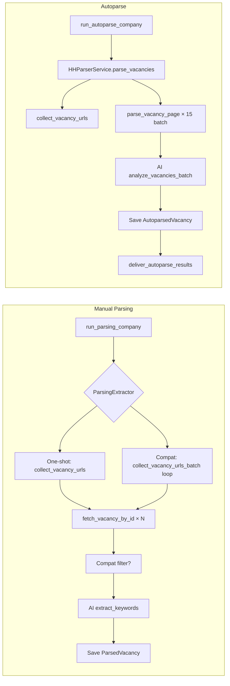

# Parsing Flow — Step-by-Step Diagram

This document describes how vacancy parsing works in hh_bot, with all branches and data flows.

---

## Simplified Flow (Two Paths)



---

## High-Level Overview

There are **two main entry points** for parsing:

1. **Manual Parsing** — `parsing.run_company` Celery task (user-triggered)
2. **Autoparse** — `autoparse.run_company` Celery task (scheduled, per company)

Both use the HH.ru API (`GET /vacancies` for search, `GET /vacancies/{id}` for detail). No HTML scraping.

---

## Flow Diagram (Mermaid)

```mermaid
flowchart TB
    subgraph Entry["Entry Points"]
        MANUAL["parsing.run_company<br/>(Celery task)"]
        AUTO["autoparse.run_company<br/>(Celery task)"]
    end

    subgraph ManualPre["Manual Parsing — Pre-checks"]
        M1[Check task_parsing_enabled]
        M2[Circuit breaker open?]
        M3[Idempotent / already completed?]
        M4[Company exists, not deleted?]
        M5[Load blacklist IDs]
        M6{use_compatibility_check?}
    end

    subgraph ManualCompat["Manual — Compat Branch"]
        MC1[Fetch user tech_stack + work_exp]
        MC2[compat_params = tech_stack, work_exp, threshold]
        MC3[Checkpoint restore?]
        MC4[resume_from = urls, skip_count]
    end

    subgraph ManualNoCompat["Manual — No Compat Branch"]
        MN1[Checkpoint restore?]
        MN2{resume_from?}
        MN3["HHScraper.collect_vacancy_urls<br/>GET /vacancies paginated"]
        MN4[resume_from = vacancies, 0]
    end

    subgraph Extractor["ParsingExtractor.run_pipeline"]
        E1{compat_params?}
        E2["_run_pipeline_one_shot"]
        E3["_run_pipeline_with_compat"]
    end

    subgraph OneShot["One-Shot Pipeline"]
        OS1["vacancies = collect_vacancy_urls<br/>(or from resume_from)"]
        OS2[No vacancies? → return empty]
        OS3["_process_vacancy_batch"]
    end

    subgraph CompatLoop["Compat Pipeline — Fetch-More Loop"]
        CL1["First batch: collect_vacancy_urls_batch<br/>batch_size = max(50, target_count)"]
        CL2[No batch? → return empty]
        CL3["_process_vacancy_batch"]
        CL4{processed >= target_count?}
        CL5["Next batch: collect_vacancy_urls_batch<br/>exclude_ids = seen_ids"]
        CL6{has_more?}
        CL7[Process remaining batch]
    end

    subgraph ProcessBatch["_process_vacancy_batch"]
        PB1["For each batch of 8 vacancies<br/>(_COMPAT_BATCH_SIZE)"]
        PB2["_scrape_one: fetch_vacancy_by_id<br/>GET /vacancies/{id}"]
        PB3["_map_api_vacancy_to_page_data<br/>→ VacancyData"]
        PB4{compat_params?}
        PB5["AI: calculate_compatibility_batch"]
        PB6{score >= threshold?}
        PB7[Skip: on_vacancy_processed(current, total, None)]
        PB8["AI: extract_keywords"]
        PB9["on_vacancy_processed(current, total, vacancy_data)"]
        PB10["→ _save_single_vacancy (ParsedVacancy + Blacklist)"]
    end

    subgraph Scraper["HHScraper"]
        S1["_build_api_url: web URL → api.hh.ru/vacancies"]
        S2["_fetch_api_page: GET + retry backoff"]
        S3["_extract_vacancies_from_api_response<br/>+ keyword filter"]
        S4["_collect_new_from_page<br/>blacklist, seen_urls, target_count"]
        S5["Stop: 3 pages with zero new, or page >= total_pages"]
    end

    subgraph AutoparseFlow["Autoparse Flow"]
        A1[Lock, circuit breaker, company checks]
        A2["known_ids = AutoparsedVacancy for company"]
        A3["global_ids = Autoparsed + ParsedVacancy"]
        A4["HHParserService.parse_vacancies<br/>known_hh_ids=global_ids"]
        A5["Results: cached (known) + newly fetched"]
    end

    subgraph HHParser["HHParserService.parse_vacancies"]
        HP1["collect_vacancy_urls<br/>target_count + len(known)"]
        HP2["Split: cached (in known) vs to_fetch"]
        HP3["Batch fetch: asyncio.gather<br/>parse_vacancy_page × 15 concurrent"]
        HP4["parse_vacancy_page = fetch_vacancy_by_id + mapper"]
        HP5["Return merged results"]
    end

    subgraph AutoparsePost["Autoparse — Post-parse"]
        AP1["For each result: known_ids? → skip"]
        AP2["cached? → _resolve_cached_vacancy<br/>(AutoparsedVacancy or ParsedVacancy)"]
        AP3["Build to_analyze: VacancyCompatInput"]
        AP4["AI: analyze_vacancies_batch<br/>(compat score, summary, stack)"]
        AP5["_build_autoparsed_vacancy → save"]
        AP6["deliver_autoparse_results.delay"]
    end

    MANUAL --> M1
    M1 -->|disabled| M_END[return disabled]
    M1 --> M2
    M2 -->|open| M_END2[return circuit_open]
    M2 --> M3
    M3 -->|completed| M_END3[return already_completed]
    M3 --> M4
    M4 --> M5
    M5 --> M6
    M6 -->|yes| MC1
    M6 -->|no| MN1
    MC1 --> MC2
    MC2 --> MC3
    MC3 --> MC4
    MC4 --> E1
    MN1 --> MN2
    MN2 -->|no| MN3
    MN2 -->|yes| E1
    MN3 --> MN4
    MN4 --> E1

    E1 -->|yes| E3
    E1 -->|no| E2
    E2 --> OS1
    OS1 --> OS2
    OS2 -->|yes| EMPTY[PipelineResult empty]
    OS2 -->|no| OS3
    E3 --> CL1
    CL1 --> CL2
    CL2 -->|yes| EMPTY
    CL2 -->|no| CL3
    CL3 --> CL4
    CL4 -->|yes| DONE[PipelineResult]
    CL4 -->|no| CL5
    CL5 --> CL6
    CL6 -->|no| CL7
    CL7 --> DONE
    CL6 -->|yes| CL3

    OS3 --> PB1
    CL3 --> PB1
    PB1 --> PB2
    PB2 --> PB3
    PB3 --> PB4
    PB4 -->|yes| PB5
    PB4 -->|no| PB8
    PB5 --> PB6
    PB6 -->|no| PB7
    PB6 -->|yes| PB8
    PB8 --> PB9
    PB9 --> PB10

    AUTO --> A1
    A1 --> A2
    A2 --> A3
    A3 --> A4
    A4 --> HP1
    HP1 --> HP2
    HP2 --> HP3
    HP3 --> HP4
    HP4 --> HP5
    HP5 --> A5
    A5 --> AP1
    AP1 --> AP2
    AP2 --> AP3
    AP3 --> AP4
    AP4 --> AP5
    AP5 --> AP6

    MN3 --> S1
    S1 --> S2
    S2 --> S3
    S3 --> S4
    S4 --> S5
```

---

## Branch Summary

| Branch | Condition | Path |
|--------|-----------|------|
| **Manual vs Autoparse** | Task type | Manual uses `ParsingExtractor`; Autoparse uses `HHParserService` |
| **Compat vs One-shot** | `company.use_compatibility_check` | Compat: batch fetch-more loop; One-shot: single `collect_vacancy_urls` |
| **Resume from checkpoint** | `checkpoint.load_parsing` | Skip scraping; use saved URLs + skip_count |
| **Compat filter** | `compat_params` + `score >= threshold` | Passing: AI keywords → save; Failing: skip, no keywords |
| **Cached vacancy (Autoparse)** | `hh_id in global_ids` | Return as `cached=True`; resolve from DB for AI |
| **Known (Autoparse)** | `hh_id in known_ids` | Skip entirely (already in AutoparsedVacancy) |

---

## API Calls

| Step | API | Purpose |
|------|-----|---------|
| `collect_vacancy_urls` | `GET https://api.hh.ru/vacancies?page=N&per_page=50&...` | Search pages, keyword filter |
| `collect_vacancy_urls_batch` | Same | Incremental batches for compat flow |
| `fetch_vacancy_by_id` | `GET https://api.hh.ru/vacancies/{id}` | Full vacancy detail |
| `parse_vacancy_page` | Calls `fetch_vacancy_by_id` | Detail + `_map_api_vacancy_to_page_data` |

---

## Stop Conditions

| Flow | Stop when |
|------|-----------|
| `collect_vacancy_urls` | `len(collected) >= target_count` OR `page >= total_pages` OR `items` empty OR 3 consecutive pages with zero new |
| `collect_vacancy_urls_batch` | `len(collected) >= batch_size` OR same as above |
| Compat fetch-more loop | `len(processed_vacancies) >= target_count` OR `not has_more` |
| Staleness (Manual) | No progress in `parsing_staleness_window_seconds` → cancel pipeline |

---

## Data Flow

```
HH API (JSON) → _map_api_vacancy_to_page_data → page_data
    → VacancyData (extractor)
    → build_vacancy_api_context (for AI prompts)
    → ParsedVacancy / AutoparsedVacancy (ORM)
```

Employer/Area: `employer_data` / `area_data` → `HHEmployerRepository.get_or_create_by_hh_id` → `employer_id` / `area_id` FK.
